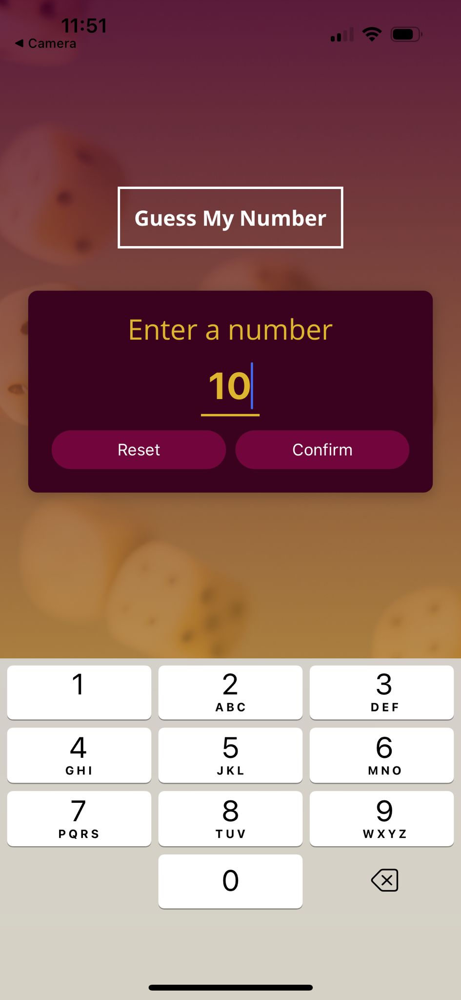
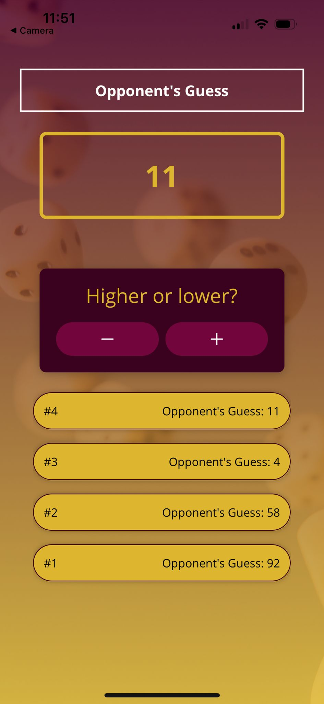
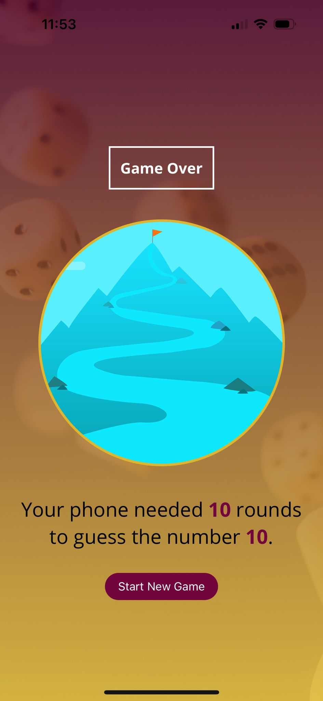

# Guess My Number (React Native Mini Game)

A mobile game built with **React Native** and **Expo** where the user selects a secret number and the app tries to guess it. The game ends when the app correctly identifies the number, showing how many rounds it took.

---

## Screenshots

### Start Screen



### Game Screen



### Game Over Screen



---

## Features

- Start screen to enter the secret number.
- Interactive guessing logic with _Higher_ and _Lower_ buttons.
- Round counter and guess log displayed in a styled list.
- Game Over screen with summary and restart option.
- Custom fonts loaded with `expo-font`.
- Modern UI using **SafeAreaView**, **LinearGradient**, and **ImageBackground**.

---

## Tech Stack

- [React Native](https://reactnative.dev/)
- [Expo](https://expo.dev/)
- `react-native-safe-area-context`
- `expo-linear-gradient`
- `@expo/vector-icons`

---

## Installation & Running

1. Clone the repository:

   ```bash
   git clone https://github.com/maitepv87/rn-mini-game.git
   cd rn-mini-game
   ```

2. Install dependencies:

   ```bash
    npm install
    # or
    yarn install
   ```

3. Start the project with Expo:

   ```bash
   npm start
   # or
   expo start
   ```

4. Scan the QR code with the Expo Go app on your mobile device.

## Project Structure

```plaintext
.
├── App.js
├── screens/
│   ├── StartGameScreen.js
│   ├── GameScreen.js
│   └── GameOverScreen.js
├── components/
│   ├── ui/
│   │   ├── PrimaryButton.js
│   │   ├── Title.js
│   │   ├── Card.js
│   │   └── InstructionText.js
│   └── game/
│       ├── NumberContainer.js
│       └── GuessLogItem.js
├── assets/
│   ├── fonts/
│   └── images/
└── constants/
    └── colors.js
```
